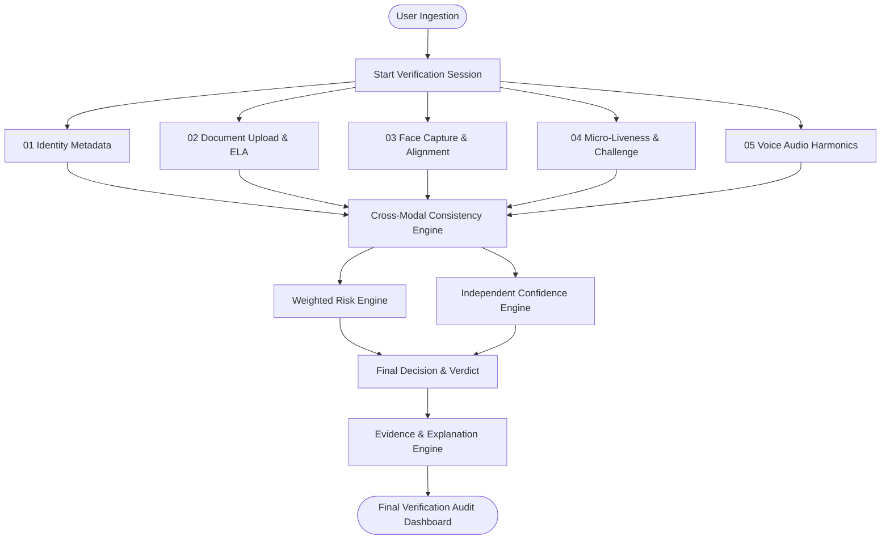
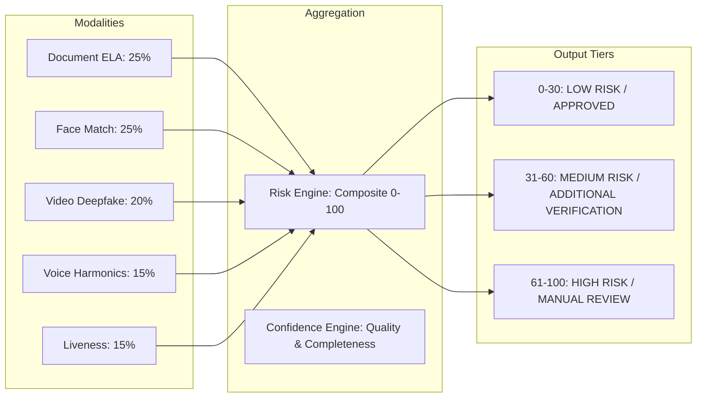

# AuthenAI System Architecture & Engineering Specification

> **"Verify the Person. Trust the Identity."**

AuthenAI is an enterprise-grade multi-modal zero-trust verification platform that cross-correlates biometric, document, and acoustic signals to expose deepfake impersonation and synthetic identity fraud.

---

## 1. High-Level Multi-Modal Pipeline

---

## 2. Decision Fusion Architecture

---

## 3. Database & Ephemeral Storage Architecture

- **Session Datastore**: MongoDB (or in-memory fallback during local evaluation).
- **Ephemeral Processing**: Raw image frames and audio payloads are analyzed in-memory via stream buffers and discarded immediately. Only forensic audit hashes, extracted non-PII metrics, and timestamps are persisted.
